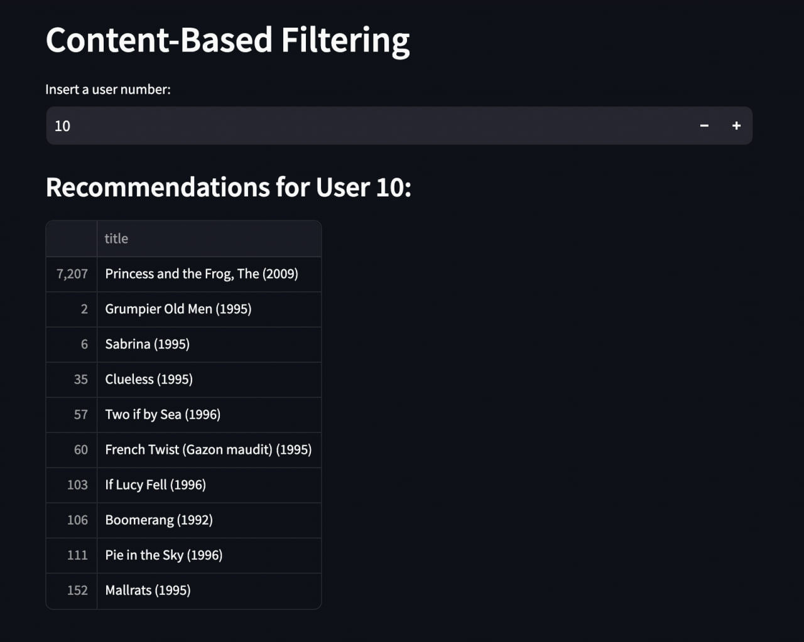

# UCU Recommenders System 2023

## Table of Contents

1. [Introduction](#introduction)
2. [Features](#features)
3. [Installation](#installation)
4. [Usage](#usage)
5. [License](#license)

## 1. Introduction

Welcome to UCU Recommender System 2023! This project is an implementation of a recommender system developed as part of the Ihor Kosovych, Diana Kapatsyn and Stas Shostak team at the Ukrainian Catholic University. The recommender system aims to provide personalized movie recommendations to users based on their preferences and historical interactions.

## 2. Features

- User-based collaborative filtering
- Item-based collaborative filtering
- Matrix factorization techniques (e.g., Singular Value Decomposition)
- Content-based filtering
- Hybrid recommendation approaches
- Evaluation metrics (e.g., RMSE, MAE) for assessing recommendation performance

## 3. Installation

To get started with UCU Recommender System 2023, follow these steps:

1. Clone the repository: `git clone https://github.com/IKosovych/ucu-recommender-system-2023.git`
2. Navigate to the project directory: `cd ucu-recommender-system-2023`
3. Install the required dependencies: `pip install -r requirements.txt`

With Docker
1. `docker build -t my_streamlit_app .`

Please note any specific system requirements or dependencies that might be needed.

## 4. Usage

Here's how you can use UCU Recommender System 2023:

1. Run a command `streamlit run app.py`
2. Interact with model

With Docker
1. `docker run -p 8501:8501 my_streamlit_app`

## 5. License

UCU Recommender System 2023 is licensed under the [choose appropriate license (e.g., MIT, Apache, GPL)] License. See the [LICENSE](LICENSE) file for more details.
